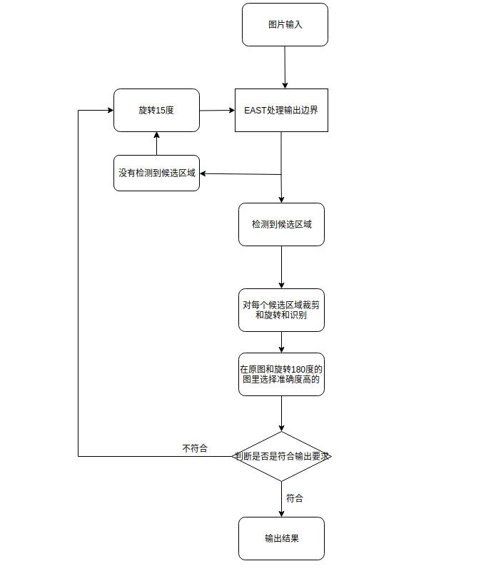
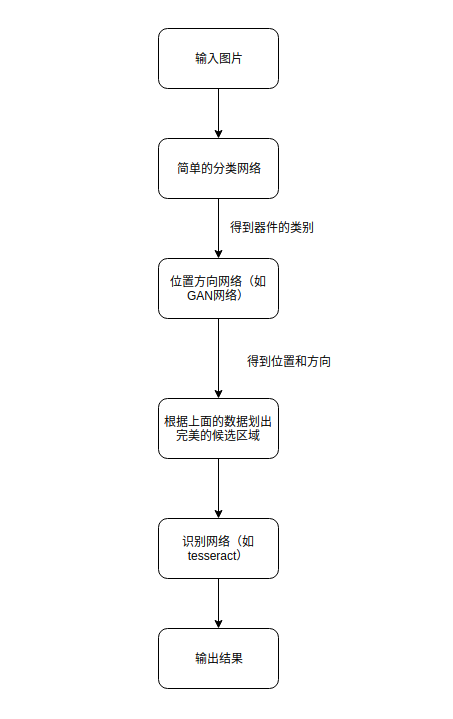
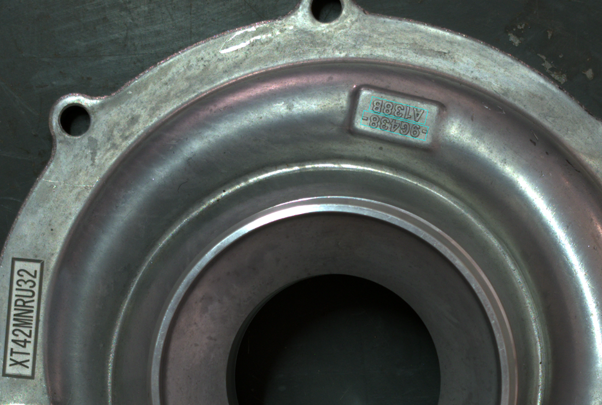

# 基于EAST的ocr

### EAST的准备
tensorflow 1.x版本都可以，基于ICDAR 2013和2015的数据集训练好的模型: [BaiduYun link](http://pan.baidu.com/s/1jHWDrYQ) [GoogleDrive](https://drive.google.com/open?id=0B3APw5BZJ67ETHNPaU9xUkVoV0U)


如果自己训练的话，预训练模型 Resnet V1 50 provided by tensorflow slim: [slim resnet v1 50](http://download.tensorflow.org/models/resnet_v1_50_2016_08_28.tar.gz)
将训练集放到合适的位置，运行下面的代码

```
python3 multigpu_train.py --gpu_list=0 --input_size=512 --batch_size_per_gpu=14 --checkpoint_path=/tmp/east_icdar2015_resnet_v1_50_rbox/ \
--text_scale=512 --training_data_path=/data/ocr/icdar2015/ --geometry=RBOX --learning_rate=0.0001 --num_readers=24 \
--pretrained_model_path=tmp/resnet_v1_50.ckpt
```
### 流程

可以选取自己训练好的模型来替代原有的模型，图片经过EAST系统后的输出是一个个的长方形框，不过这些框很多都是斜的，根据这个信息可以去判断出字符的倾斜方向，因为我没有找到根据4个坐标点进行直接截取的api，所以就简单截取了最小的bounding box，然后对bounding box 进行字符的提取和识别。具体的识别方法暂时使用较为常见的tesseract。（我刚开始的时候也尝试过使用先去旋转，再去截取长方形的方法，这个在算法上是可行的，但是可能存在有些字符是靠近图片的边界的，所以在旋转之后可能会被上边界盖住，这个时候就不能用了）因为EAST在识别的过程中会对方向偏的比较厉害的方框识别不到，所以可以在识别不到的情况下，进行不断的旋转来识别。

运行
```
python3 eval.py --test_data_path=/tmp/images/ --gpu_list=0 --checkpoint_path=/tmp/east_icdar2015_resnet_v1_50_rbox/ \
--output_dir=demo_images/
```

流程图如下：





其中代码的部分还有一些bug，后面我会把这个完善一下。

### 建议
因为系统中有各种信息可以利用，即便ocr处于第一步，利用不到流水线上的信息。但是仍然有很多的已知信息可以去利用，比如说我们其实基本上已经知道了生产的部件有什么，而且我们已经有了cad图。所以如果能够利用到这一块，将会很大程度上降低硬件的开支，提高检测的准确率。因为后面3d检测都可以输出6d的位置，在已知平面的情况下，仅仅需要输出位置和方向，无论是复杂程度还是可行性都是有保障的。有了位置和方向之后，我们就可以确定候选区域了，因为标号基本上都会打在具体的地方，即便不是特别具体，去截取几十个候选区域也没关旭。这些截取到的候选区域基本上都可以在截取的时候都很正了，基本上不会有歪的。

具体思路如下：



这种情况下，就不需要使用EAST这种全卷机网络去寻找字符位置了。而且可以避免零件上的其他字符的干扰，比如说下面这种。




缺点就是如果后面要加入其他的零件，稍微会花费功夫，但是可以把这种需要新加入的零件的步骤脚本化，写一个自动化的脚本进行添加。


